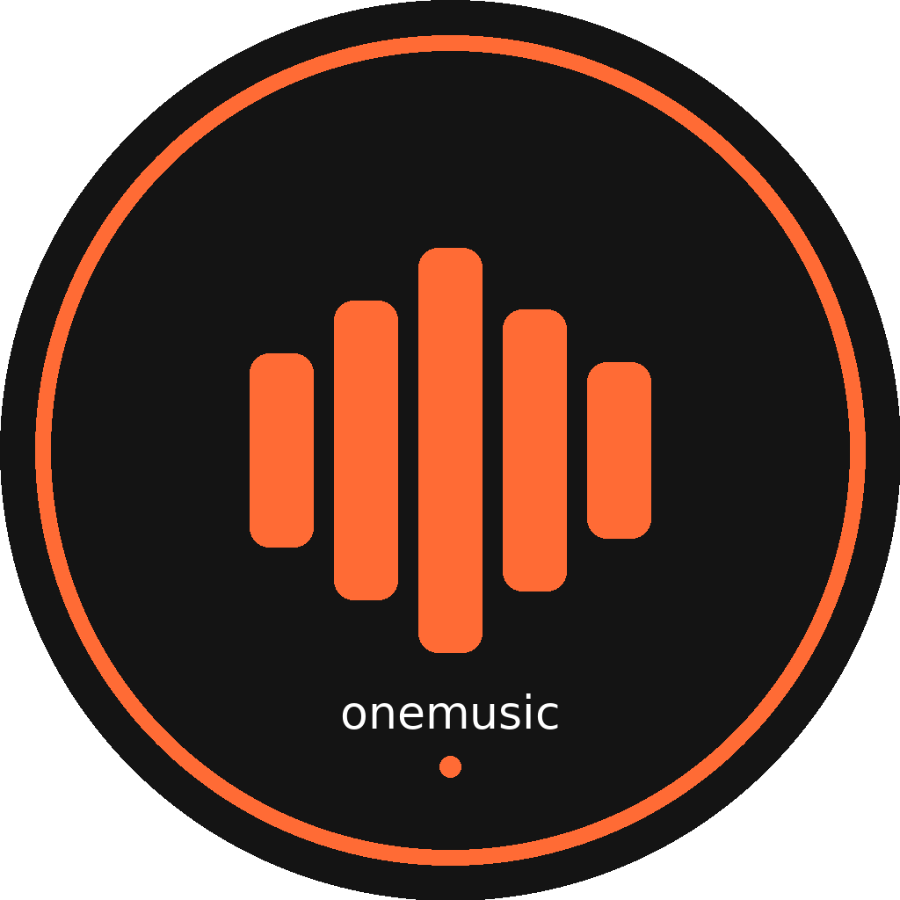

<div align="center">

<!-- Logo -->


<br/>

# 🎵 OneMusic

### The Ultimate Ad-Free Open Source Music Streaming App for Android

> **Stream Millions of Songs — Zero Ads. Zero Subscription. Zero Compromise.**

[
[
[
[
[
[

<br/>

**[⬇️ Download APK](https://github.com/AkshatRaj00/OneMusic/releases/latest)** &nbsp;- &nbsp;
**[⭐ Star This Repo](https://github.com/AkshatRaj00/OneMusic/stargazers)** &nbsp;- &nbsp;
**[🐛 Report Bug](https://github.com/AkshatRaj00/OneMusic/issues)** &nbsp;- &nbsp;
**[💬 Join Discord](https://discord.com/channels/1022587029789343805/1022587030275899394)** &nbsp;- &nbsp;
**[🌐 OnePerson AI](https://onepersonai.in)**

<br/>

> A product by **[OnePerson AI](https://onepersonai.in)** — Built for the people, by the people.

</div>

***

## 📸 Screenshots

> *Clean UI -  Dark Theme -  Smooth Animations*

<!-- Add screenshots here after first release -->
| Home Screen | Player Screen | Search Screen | Library |
|:-----------:|:-------------:|:-------------:|:-------:|
| Coming Soon | Coming Soon | Coming Soon | Coming Soon |


***

## ✨ Features

### 🎵 Music & Playback
- **100% Ad-Free** — No ads, ever. Not even banner ads.
- **Background Playback** — Music keeps playing when screen is off
- **Notification Controls** — Play, pause, skip from notification bar
- **Lock Screen Controls** — Control music without unlocking phone
- **Queue Management** — Build your playlist on the fly

### 🔍 Smart Search & Discovery
- **Live Search Suggestions** — Results appear as you type (like Spotify)
- **Genre Discovery** — Bollywood, Punjabi, Lofi, EDM, Classical & more
- **Trending Songs** — Auto-updated trending tracks
- **Search History** — Quick access to your past searches

### 🎨 Design & UX
- **Beautiful Dark UI** — Eye-friendly dark theme, always
- **Smooth Animations** — 60fps buttery smooth experience
- **Mini Player** — Always accessible mini player at the bottom
- **Offline Liked Songs** — Save favorites locally on device

### 🌐 Sources
- **JioSaavn** — Millions of Hindi, Punjabi & regional songs
- **YouTube Music** — Global music catalog
- **Multiple Fallbacks** — Always finds your song

### ⚡ Performance
- **Lightweight** — Optimized for all Android devices
- **Fast Loading** — Skeleton loaders, no blank screens
- **Local Storage** — Hive-based fast local data

***

## 📱 Download Now

<div align="center">

| Version | Size | Android | Status |
|:-------:|:----:|:-------:|:------:|
| v1.0.0 | ~75MB | 6.0+ | ✅ Stable |

<a href="https://github.com/AkshatRaj00/OneMusic/releases/latest">
  
</a>

**How to Install:**
1. Download APK from releases
2. Enable *"Install from unknown sources"* in Settings
3. Install & Enjoy! 🎵

</div>

***

## 🎯 Why OneMusic Over Others?

| Feature | 🎵 OneMusic | Spotify | JioSaavn | YouTube Music |
|:--------|:-----------:|:-------:|:--------:|:-------------:|
| Completely Free | ✅ | ❌ Freemium | ❌ Freemium | ❌ Freemium |
| No Ads | ✅ | ❌ | ❌ | ❌ |
| Open Source | ✅ | ❌ | ❌ | ❌ |
| No Login Required | ✅ | ❌ | ❌ | ❌ |
| Background Play (Free) | ✅ | ❌ | ❌ | ❌ |
| Offline Liked Songs | ✅ | ❌ Paid | ❌ Paid | ❌ Paid |
| No Data Collection | ✅ | ❌ | ❌ | ❌ |

***

## 🛠️ Tech Stack

```
📱 Frontend    →  Flutter 3.x (Dart)
🎵 Playback    →  media_kit + ExoPlayer
🌐 Music API   →  JioSaavn + YouTube
💾 Storage     →  Hive (NoSQL local DB)
🔄 State       →  Provider
🖼️ Images      →  CachedNetworkImage
🔔 Background  →  audio_service
```

***

## 🚀 For Developers — Run Locally

```bash
# 1. Clone the repository
git clone https://github.com/AkshatRaj00/OneMusic.git
cd OneMusic

# 2. Install Flutter dependencies
flutter pub get

# 3. Run on device/emulator
flutter run

# 4. Build release APK
flutter build apk --release
```

**Requirements:**
- Flutter SDK 3.x
- Android Studio / VS Code
- Android device or emulator (API 23+)

***

## 🤝 Contributing

Contributions are welcome! Here's how:

1. **Fork** this repository
2. Create your feature branch: `git checkout -b feature/AmazingFeature`
3. Commit changes: `git commit -m 'Add AmazingFeature'`
4. Push to branch: `git push origin feature/AmazingFeature`
5. Open a **Pull Request**

***

## 🌐 Connect & Community

<div align="center">

Built with ❤️ by **Akshat Raj** — Founder, [OnePerson AI](https://onepersonai.in)

<br/>

[
[
[
[
[
[
[
[

</div>

***

## 📊 Repository Stats

<div align="center">


</div>

***

## ⚠️ Disclaimer

> This application is developed for **educational and personal use only**.  
> All music content is streamed directly from third-party public APIs.  
> OneMusic does **not** store, host, or distribute any copyrighted content.  
> No user data is collected or sold. We respect your privacy.  
> All trademarks belong to their respective owners.

***

<div align="center">

## ⭐ Support OneMusic

**If this app made your day better, give it a ⭐ star!**  
It helps more people discover OneMusic and motivates development. 🙏

<br/>

*Made with ❤️ in India 🇮🇳 | A [OnePerson AI](https://onepersonai.in) Product*

</div>


<!-- SEO Keywords (hidden): free music app android, ad-free music player, open source spotify alternative, 
free music streaming android 2024, jiosaavn alternative, youtube music alternative free, 
flutter music app, best free music app india, hindi songs app free, offline music player android,
no ads music app, free music download android, OneMusic app, open source music player flutter dart -->
