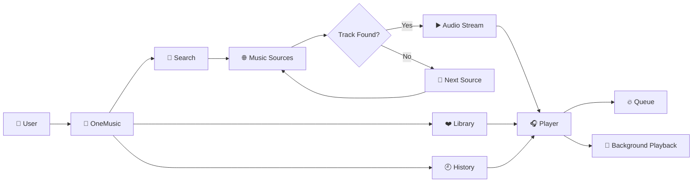

# 🎵 OneMusic

<p align="center">
  
  
  
  
</p>

<p align="center">
  <strong>Free • Open Source • Ad-Free Music Streaming</strong><br/>
  A clean, fast and distraction-free music experience by <b>OnePersonAI</b>.
</p>

<p align="center">
  🎧 Stream &nbsp;•&nbsp; 🔎 Discover &nbsp;•&nbsp; ❤️ Like &nbsp;•&nbsp; ⚡ Play &nbsp;•&nbsp; 📱 Listen
</p>

---

## 🎬 Demo

<p align="center">

<a href="YOUR_VIDEO_LINK">
  
</a>

</p>

<p align="center">
  
</p>

---

## ✨ Features

```text id="f1"
🎧 Smart Autoplay
🔥 Infinite Music Queue
🌙 Premium Dark UI
❤️ Liked Songs
🕘 Recently Played
🔍 Fast Search
📱 Responsive Experience
🆓 Completely Free
🌍 Open Source
⚡ Lightweight & Fast
```

---

## 🔄 OneMusic Flow


```mermaid id="j3p8z2"
flowchart LR
    A[👤 User] --> B[🎵 OneMusic]

    B --> C[🔎 Search]
    B --> D[❤️ Library]
    B --> E[🕘 History]

    C --> F[🌐 Music Sources]
    F --> G{Track Found?}

    G -->|Yes| H[▶️ Audio Stream]
    G -->|No| I[🔄 Next Source]

    I --> F

    H --> J[🎧 Player]
    J --> K[🔥 Queue]
    J --> L[📱 Background Playback]

    D --> J
    E --> J
```

---

## 🏗️ Architecture

```text id="q0t4f6"
                    ┌──────────────────┐
                    │     OneMusic     │
                    └────────┬─────────┘
                             │
             ┌───────────────┼────────────────┐
             ▼               ▼                ▼
         Search UI       Music Engine      Library
             │               │                │
             ▼               ▼                ▼
        Music Sources    Audio Player      Favorites
                             │
                  ┌──────────┼──────────┐
                  ▼          ▼          ▼
               Queue     Background   History
                  │          Audio        │
                  └──────────┼───────────┘
                             ▼
                       🎧 User Experience
```

---

## 🧠 Core Experience

```text id="y4d1x9"
Search
  ↓
Find Track
  ↓
Resolve Stream
  ↓
Play Audio
  ↓
Queue / Autoplay
  ↓
Background Playback
  ↓
History + Favorites
```

---

## 🛠️ Tech Stack

| Layer | Technology |
|---|---|
| Mobile App | **Flutter / Dart** |
| Android | **Kotlin + Gradle** |
| Music Sources | **JioSaavn / YouTube** |
| Audio | **Streaming Engine** |
| UI | **Modern Dark UI** |
| Website | **Web + Vercel** |
| Releases | **GitHub Releases** |

---

## 📱 Screenshots

<p align="center">
  
  
  
  
</p>

---

## 🌐 Official Website

<p align="center">

<a href="https://onemusic-website.vercel.app/">
  
</a>

</p>

---

## 📥 Download

<p align="center">

<a href="https://github.com/AkshatRaj00/OneMusic/releases/tag/main">
  
</a>

</p>

---

## 🎯 Why OneMusic?

```text id="5w2a9e"
Traditional Music Apps
        ↓
Ads
Subscriptions
Login Walls
Distractions
        ↓
      OneMusic
        ↓
Music First 🎧
```

> **Music experience first.**

---

## 🚀 Vision

OneMusic is built under the **OnePersonAI** ecosystem with a simple vision:

```text id="2x4m7c"
Clean Design
     +
Open Technology
     +
Free Music Experience
     =
      OneMusic 🎵
```

---

## 🤝 Contributing

```text
Fork
 ↓
Improve
 ↓
Test
 ↓
Pull Request
 ↓
OneMusic ❤️
```

Bug reports, UI improvements, performance optimizations and new features are welcome.

---

<p align="center">

### 🎵 OneMusic

<strong>Music without the noise.</strong>

<br/>

Built with ❤️ by <b>OnePersonAI</b>

<br/><br/>

⭐ <b>Star the repository if you like it.</b>

</p>
